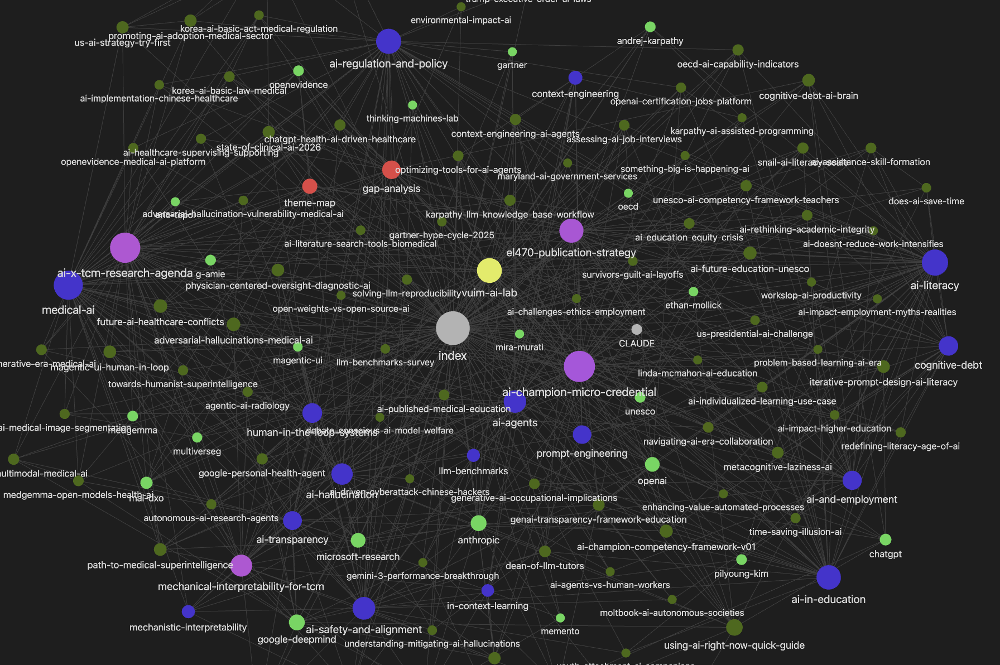
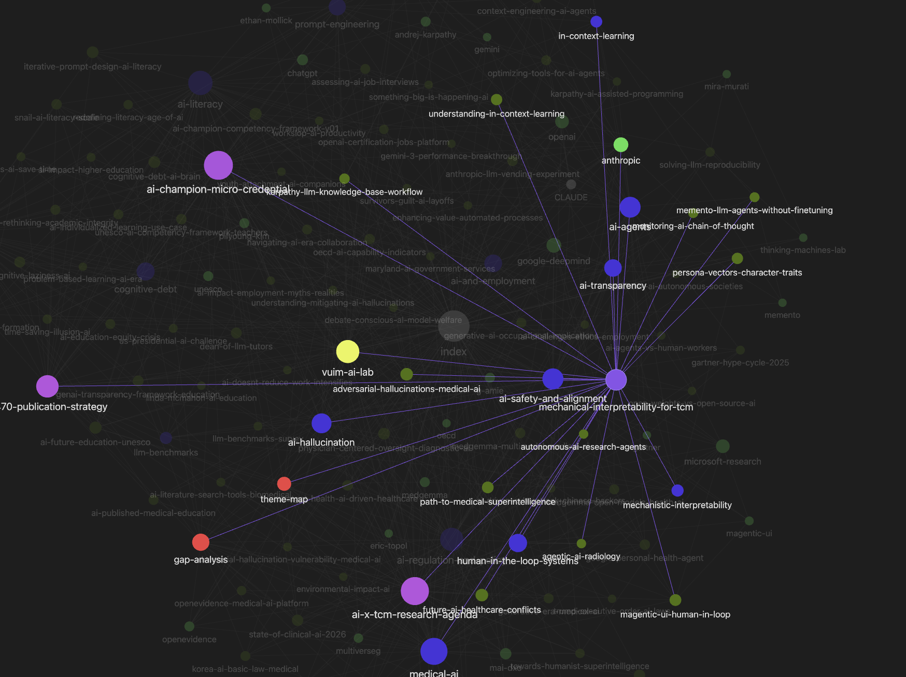
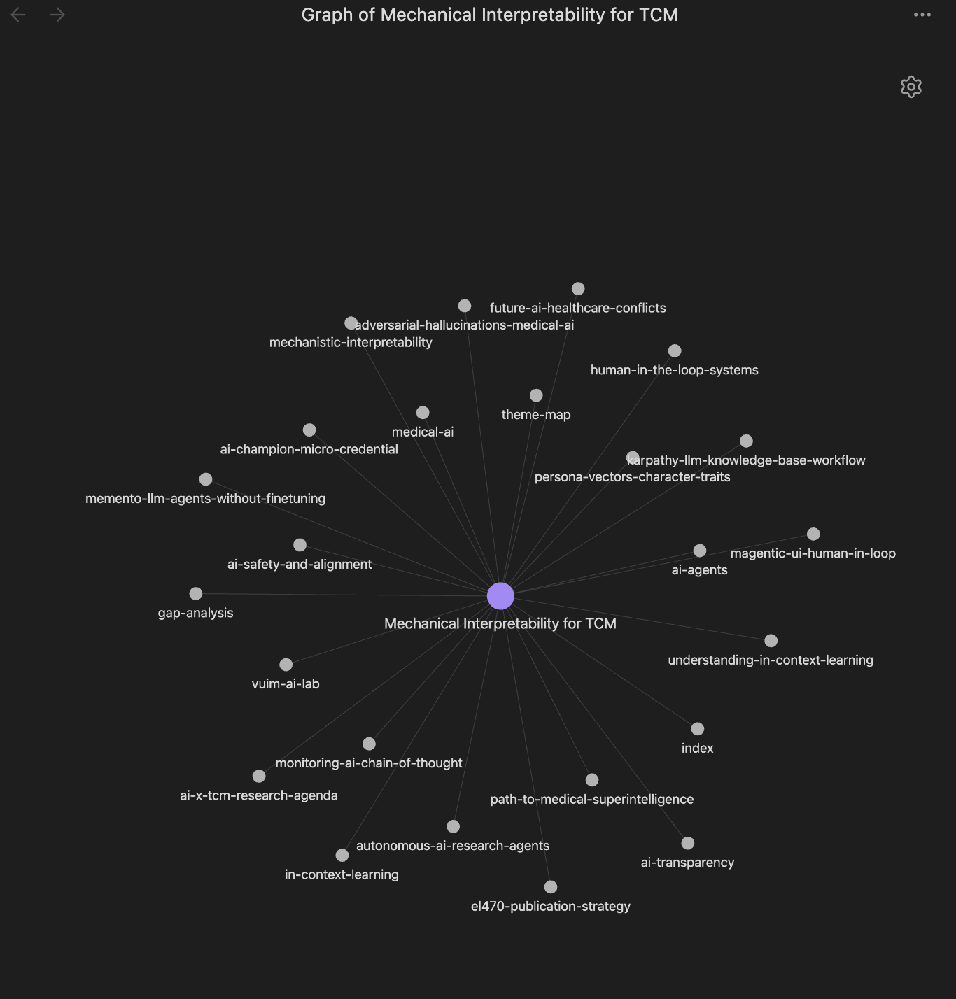

# AI Knowledge Wiki

**A Karpathy-style LLM Wiki built by an educator.**

A Karpathy-style LLM Wiki on AI literacy, built by a TCM educator and AI adopter. A non-developer's work.
I curate AI-related articles, papers, and posts for my teaching and research. This wiki compiles 81 sources into a structured, cross-linked Obsidian vault using the LLM Wiki pattern proposed by Andrej Karpathy.

---

## The Problem

I've been curating AI-related articles, papers, and posts through an automated pipeline (Make.com → Claude API → Notion DB + Google Drive). About a hundred items accumulated. But each one sat as an independent row in a database. 

## The Trigger

On April 2, 2026, Karpathy posted about "LLM Knowledge Bases" (19M+ views). The core idea: RAG rediscovers knowledge every time. A wiki *compounds* it. I opened Claude Code and started building.

## The Result

| | |
|---|---|
| **Source articles** | 81 (78 curated + 3 supplementary) |
| **Concept pages** | 16 |
| **Project pages** | 4 |
| **Total wiki pages** | ~130 |
| **Cross-links** | 220+ |
| **Gap analysis findings** | 7 (3 high, 3 medium, 1 low) |
| **Theme clusters** | 4 |
| **Orphan pages** | 0 |
| **Broken links** | 0 |

---

## What's Next

81 sources is a starting point. The whole idea of Karpathy's LLM Wiki is that it compounds. Every new article I add gets woven into the existing concept pages, cross-linked, and checked against the gap analysis. The wiki grows like compound interest.

I need a few hundred sources before the knowledge structure and gap discovery become truly powerful. But even at this scale, I'm already browsing the Obsidian graph and noticing things: *this cluster is thin, that connection is surprising, here's a gap I should fill.* That's the payoff.

---

## Graph Views

### Full Graph: 130 pages, 220+ links


### Node Selected: AI Champion Micro-Credential highlighted


### Local Graph: Mechanical Interpretability for TCM


---

## How It Was Built

```
Notion curation (84 items, Make.com automation)
    ↓
CSV metadata + Google Drive originals
    ↓
Google Takeout → DOCX export
    ↓
Claude Code (pandoc) → Markdown conversion
    ↓
Claude Code → Wiki compilation (5 batches)
    ↓
Lint + gap analysis + cross-link reinforcement
    ↓
Obsidian vault + GitHub repo
```

The original articles live in Google Drive, auto-saved by a Make.com pipeline. I exported them via Google Takeout, converted to Markdown with pandoc, then had Claude Code read every document and compile concept pages, entity pages, source summaries, and project pages. 15 documents at a time, 5 batches total.

---

## Vault Structure

```
ai-knowledge-wiki/
├── CLAUDE.md          # Wiki operating manual
├── index.md           # Master index
├── log.md             # Work log
│
├── raw/               # Original sources (not included in public repo)
├── sources/           # Per-source summary pages (not included)
│
├── concepts/          # 16 concept pages (the core of the wiki)
│   ├── ai-literacy-education.md
│   ├── medical-ai.md
│   ├── ai-ethics-and-policy.md
│   ├── cognitive-effects-of-ai.md
│   ├── metacognitive-collapse.md
│   └── ...
│
├── entities/          # People, organizations, tools
├── projects/          # 4 research projects
│   ├── mechanical-interpretability-tcm.md
│   ├── el470-publication-strategy.md
│   ├── ai-champion-micro-credential.md
│   └── ai-x-tcm-research-agenda.md
│
├── brain/             # Upper context (AI Lab umbrella doc)
├── synthesis/         # Gap analysis, theme map
└── outputs/           # Query/analysis results
```

### What's in `raw/` and `sources/` (not public)

The `raw/` folder contains 81 original articles I collected. Research papers on AI hallucination in medical imaging, Ethan Mollick's posts on AI and education, OECD AI capability indicators, UNESCO's AI competency framework for teachers, analyses of the Gartner AI Hype Cycle, deep dives into prompt engineering and context windows. Each one was auto-processed through my Make.com pipeline: summarized, tagged, and annotated by Claude API before landing in Notion and Google Drive.

The `sources/` folder has a wiki-style summary page for each article, linking it to relevant concept and entity pages. These aren't included in the public repo because the raw material contains other people's writing.

### What's public

The `concepts/`, `projects/`, `synthesis/`, and `brain/` folders are my own synthesis work. Concept pages pull from multiple sources to map out a topic (consensus, debates, gaps). Project pages connect my research ideas to the evidence base. The gap analysis identifies what the collection *doesn't* cover.

---

## Concept Pages

Each concept page follows a template:

- **Definition**: 1-2 sentence summary
- **Key arguments**: What the sources say, including consensus and debates
- **Related sources**: Links to individual source summaries
- **Related concepts**: Cross-links to other concept pages
- **Project connections**: How this concept feeds into my research
- **Gaps**: What the collection doesn't address

The 16 concepts include: AI Literacy, Medical AI, AI Ethics and Policy, AI Agents, AI and Employment, Prompt Engineering, AI Hallucination, Cognitive Effects of AI, Metacognitive Collapse (my own framework on System 1/2 boundary disruption by AI), Mechanistic Interpretability, and others.

---

## References

- [Andrej Karpathy, "LLM Knowledge Bases"](https://x.com/karpathy/status/2039805659525644595) (April 2, 2026)
- [Karpathy's GitHub gist: LLM Wiki pattern](https://gist.github.com/karpathy/442a6bf555914893e9891c11519de94f)
- [breferrari/obsidian-mind](https://github.com/breferrari/obsidian-mind): Claude Code + Obsidian template. Engineering-focused. This project takes an education-first approach.

---

## About

I'm Sung Woo, Academic Dean at [Virginia University of Integrative Medicine](https://www.vuim.edu). I teach AI literacy to acupuncture students and faculty. My background is in philosophy and aesthetics.

I started paying attention to AI when ChatGPT launched in late 2022. Since then I've taught myself Claude API, Python, Make.com, Power BI, and now Obsidian and Git. This wiki is part of a larger effort to figure out what AI literacy means for healthcare educators who never expected to need it.

[LinkedIn](https://www.linkedin.com/in/sungwon-woo/)
